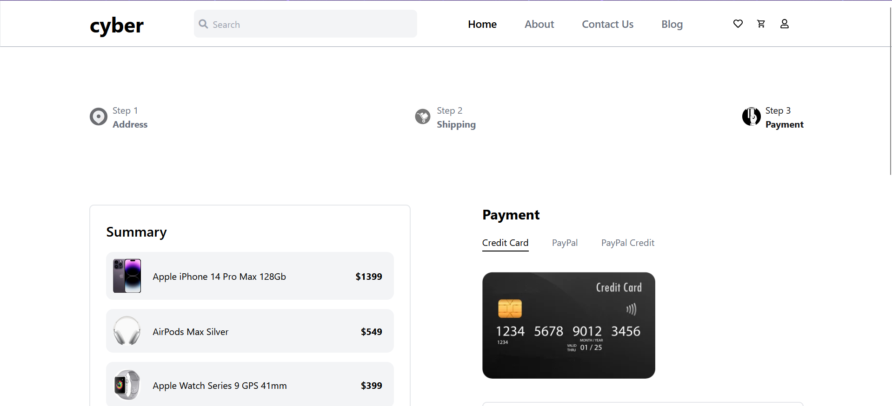
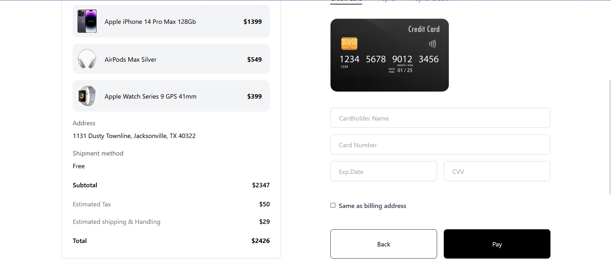
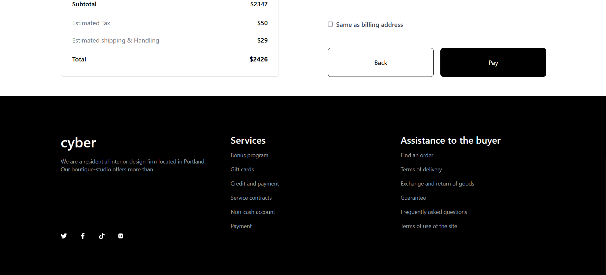

# Twospoon.ai Frontend Web Development Assignment

## Project Link

To view the project, click [here](https://sudeev-divakar-twospoonai-frontend.vercel.app/)

## Overview

This is a Frontend Web Development Assignment made using React and Tailwind CSS.
In this assessment, Twospoon.ai provided me with a Figma design, which I then had to use to create a static webpage which looked exactly the same, down to every last detail.

## Preview

Furthur images present in ./project_images
